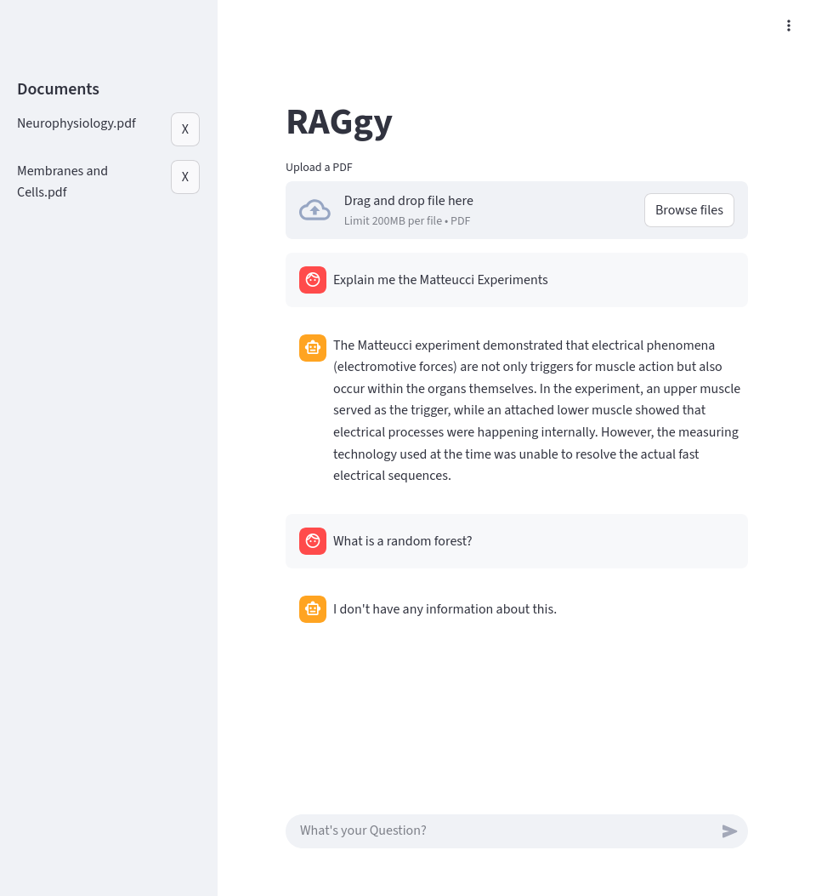

# RAGgy
## Overview
RAGgy is a Retrieval-Augmented Generation (RAG) application, which answers users requests and questions based on provided documents.
It allows users to upload PDF documents and query them naturally using Google's Gemini models.

This project demonstrates a modern implementation of the RAG pipeline using LangChain's Expression Language (LCEL) for orchestration and ChromaDB for vector storage, wrapped in a user-friendly Streamlit interface.
## Demonstration

The screenshot showcases the system correctly explains an experiment from a provided neurophysiology document, while properly rejecting to answer a question about random forests which were not part of the provided documents.

## Tech Stack
* **Frontend:** Python/Streamlit
* **Orchestration:** LangChain (LCEL/Runnable Protocol)
* **LLM:** Gemini 3.0 Flash
* **Embeddings:** Google `text-embedding-004`
* **Vector Store:** ChromaDB

## Technical Implementation
RAGgy is implemented with a modern, robust pipeline with metadata management.
### The Pipeline (LCEL)
The core logic utilizes LangChain's Expression Language (LCEL) for clear data flow control. Therefore, context injection and prompt formatting are decoupled and easier to test.
```Python
rag_chain = (
    {
        "context": retriever | _format_docs, #format docs ensures single string is passed
        "input": RunnablePassthrough()
    }
    | prompt
    | llm
    | StrOutputParser()
)
```
### Metadata Management
A common challenge in RAG is data staleness. RAGgy addresses this by tagging every vector chunk with source metadata during ingestion. When a user deletes a file via the UI, the system performs a filtered delete in ChromaDB. This ensures the knowledge base remains clean and up-to-date.

### Vector Store
ChromaDB is used as a long-term memory. Chroma is used, because it can run locally without a complex infrastructure.
* **Embedding Storage:** It stores high-dimensional vector embeddings generated by Google's `text-embedding-004` model.
* **Similarity Search:** When a user asks a question, Chroma performs a semantic similarity search to retrieve only the most relevant document chunks, which are then passed to Gemini.
* **Persistence:** The database is configured to persist data to the local disk. Therefor the knowledge base remains even after the application restarts.

## Roadmap:
- [x] MVP implementation
- [x] Deletion of Chunks
- [ ] Query Rewriting (Optimize user queries automatically)
- [ ] mathematical evaluation of output
- [ ] Show sources for claims
- [ ] Smarter Chunking (Semantic Chunking / Parent-Child Chunking)
- [ ] Scalable Deletion of Chunks
- [ ] Combine Vector Search with Keyword Search
- [ ] System Prompt Engineering

## Getting started
### Prerequisites
* Python 3.12 or higher
* A Google Cloud API Key with Gemini access
### Installation
1. Clone the repository
```sh
   git clone https://github.com/christianberwanger/raggy.git
```
2. Install the requirements
```sh
pip install -r requirements.txt
```
3. Create a `.env` file in your project root and add your Gemini API Key
```aiexclude
GOOGLE_API_KEY=YOUR_API_KEY
```
4. Run the project
```sh
streamlit run raggy.py
```